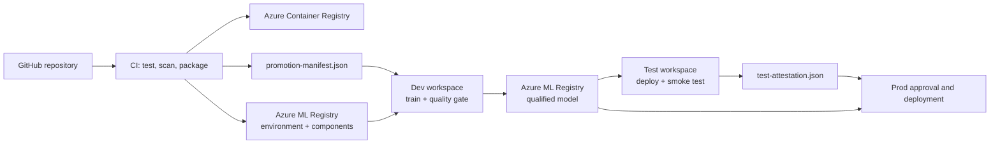

# Architecture

The design separates build-time assurance from environment promotion. CI creates one immutable, versioned set of assets. Dev, Test, and Prod consume those versions without rebuilding them.

## Trust boundaries

- Pull requests run linting, unit tests, Snyk open-source analysis, and Snyk Code analysis.
- The CI pipeline builds the package and container once and registers versioned Azure ML assets.
- The promotion manifest binds the source commit, asset version, container reference, environment, and components.
- Dev trains with version-pinned components and publishes a qualified MLflow model to the shared registry.
- Test deploys the exact model/runtime pair and creates an attestation only after a live endpoint smoke test.
- Prod uses an Azure DevOps environment approval and requires the Test attestation.

Configure Azure DevOps environment checks on `azureml-prod`; approvals are intentionally external to YAML so pipeline authors cannot bypass them in a pull request.
